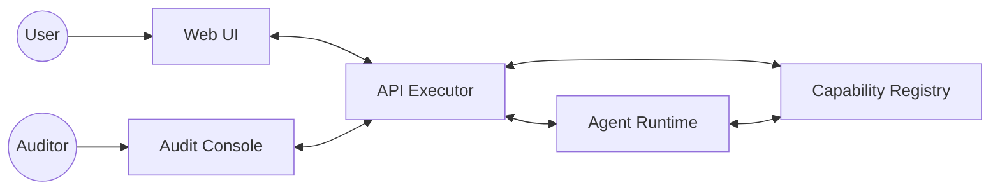
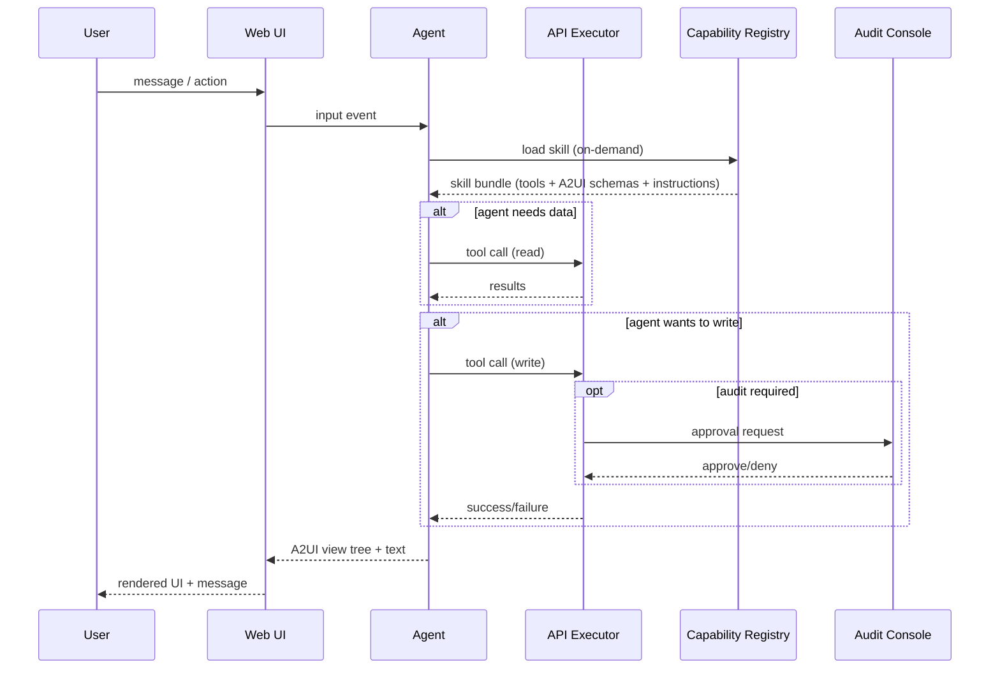

# System map

This defines the target runtime roles and boundaries.

## Components

- **Web UI**: renders A2UI view trees and sends user actions.
- **API Executor**: authoritative boundary; validates, authorizes, persists.
- **Agent Runtime**: produces plans, tool calls, and A2UI outputs.
- **Capability Registry**: stores versioned “skills” and contracts.
- **Audit Console**: approves/denies risky operations.

## High-level topology

## Runtime loop (conceptual)

## Non-negotiables

- The agent **cannot** directly write to the DB.
- The UI **does not** interpret intent; it renders and reports user actions.
- Skill bundles are **versioned** and fetched **on-demand**.
