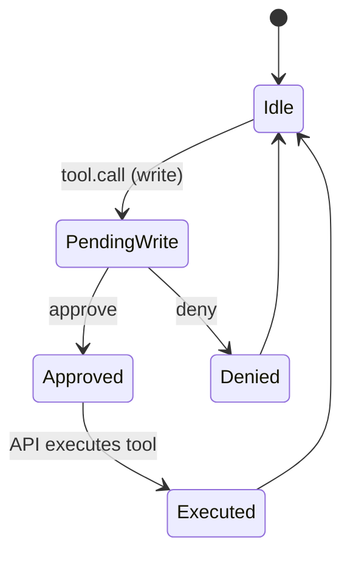

# Audit and approvals (coach audit)

Audit mode is a human-in-the-loop safety layer.

## What is gated

- **Read tools**: usually auto-approved.
- **Write tools**: require approval.
- Optional: also gate the agent’s final response.

## State machine (conceptual)



## Approval request payload

```json
{
  "type": "audit.request",
  "id": "evt_...",
  "ts": "...",
  "trace_id": "tr_...",
  "session_id": "...",
  "payload": {
    "tool": "weight_entry_save_batch",
    "args": {"rows": [/*...*/]},
    "reason": "write",
    "risk": "db_write"
  }
}
```

## Approval decision

```json
{
  "type": "audit.decision",
  "id": "evt_...",
  "ts": "...",
  "trace_id": "tr_...",
  "session_id": "...",
  "payload": {
    "decision": "approve",
    "notes": "Looks correct"
  }
}
```

## Policies

- Default: approve reads; require approval for writes.
- Writes are only allowed if they correspond to an explicit user action:
  - user typed intent *and* confirmed in UI, or
  - user pressed Save in A2UI form/batch editor.

## Operator UX

- Show pending approvals as a queue.
- Display tool name, args summary, and diffs (when possible).
- One-click approve/deny.
